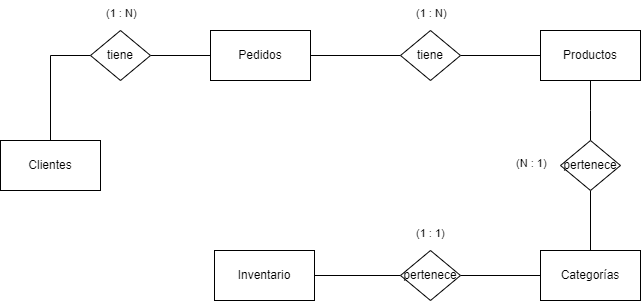

## Diagrama Entidad-Relación
El negocio contará con 5 entidades: 
  
__1. Productos__  
__2. Usuarios (Clientes)__  
__3. Pedidos__  
__4. Categorías__  
__5. Inventario__  

## Cardinalidad  
1. Usuarios a Pedidos: Uno a muchos (Un usuario puede tener muchos pedidos).  
2. Pedidos a Pedidos_Productos: Uno a muchos (Un pedido puede tener muchos productos, y cada relación se gestiona en la tabla intermedia).  
3. Productos a Pedidos_Productos: Uno a muchos (Un producto puede estar en muchos pedidos, y cada relación se gestiona en la tabla intermedia).  
4. Productos a Categorías: Muchos a uno (Muchos productos pueden pertenecer a una categoría).  
5. Productos a Inventario: Uno a uno (Un producto tiene una cantidad específica en el inventario)

## Tablas y Atributos 
Usuarios  
Pedidos  
Productos  
Categorías  
Inventario  
Pedidos_Productos  
### Tabla: Usuarios
| Atributo    | Tipo           | Restricciones                     |
|-------------|----------------|-----------------------------------|
| id_usuario  | INTEGER        | PRIMARY KEY, AUTOINCREMENT, NOT NULL |
| nombre      | TEXT           | NOT NULL                          |
| email       | TEXT           | NOT NULL                          |
| contraseña  | TEXT           | NOT NULL                          |
| dirección   | TEXT           | NULL                              |

### Tabla: Categorías
| Atributo    | Tipo           | Restricciones                     |
|-------------|----------------|-----------------------------------|
| id_categoria| INTEGER        | PRIMARY KEY, AUTOINCREMENT, NOT NULL |
| nombre      | TEXT           | NOT NULL                          |

### Tabla: Productos
| Atributo    | Tipo           | Restricciones                     |
|-------------|----------------|-----------------------------------|
| id_producto | INTEGER        | PRIMARY KEY, AUTOINCREMENT, NOT NULL |
| nombre      | TEXT           | NOT NULL                          |
| descripción | TEXT           | NULL                              |
| precio      | REAL           | NOT NULL                          |
| id_categoria| INTEGER        | FOREIGN KEY (REFERENCES Categorías(id_categoria)), NOT NULL |

### Tabla: Pedidos
| Atributo    | Tipo           | Restricciones                     |
|-------------|----------------|-----------------------------------|
| id_pedido   | INTEGER        | PRIMARY KEY, AUTOINCREMENT, NOT NULL |
| id_usuario  | INTEGER        | FOREIGN KEY (REFERENCES Usuarios(id_usuario)), NOT NULL |
| fecha_pedido| DATETIME       | NOT NULL                          |
| total       | REAL           | NOT NULL                          |

### Tabla: Inventario
| Atributo    | Tipo           | Restricciones                     |
|-------------|----------------|-----------------------------------|
| id_producto | INTEGER        | PRIMARY KEY, FOREIGN KEY (REFERENCES Productos(id_producto)), NOT NULL |
| cantidad    | INTEGER        | NOT NULL                          |

### Tabla: Pedidos_Productos
| Atributo    | Tipo           | Restricciones                     |
|-------------|----------------|-----------------------------------|
| id_pedido   | INTEGER        | PRIMARY KEY (id_pedido, id_producto), FOREIGN KEY (REFERENCES Pedidos(id_pedido)), NOT NULL |
| id_producto | INTEGER        | PRIMARY KEY (id_pedido, id_producto), FOREIGN KEY (REFERENCES Productos(id_producto)), NOT NULL |
| cantidad    | INTEGER        | NOT NULL                          |
  
