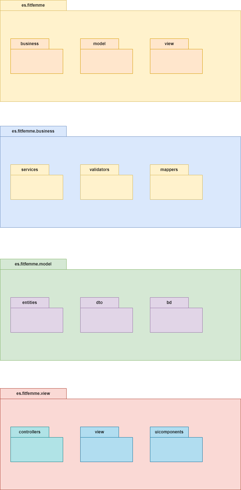

# Diagrama de paquetes

## Modelo Vista Controlador (MVC)
- __Business__  
Dentro de la capa de negocios (business layer), los paquetes típicos que se pueden encontrar en una arquitectura de aplicación son aquellos que organizan la lógica de negocio de manera coherente y modular. Estos paquetes pueden variar según las necesidades específicas del proyecto, pero aquí hay algunos ejemplos comunes:

1. Servicios (Services):

Este paquete contiene clases que encapsulan la lógica de negocio y proporcionan servicios específicos a otras partes de la aplicación.
Los servicios pueden coordinar las operaciones entre múltiples entidades del modelo y aplicar reglas de negocio complejas.
Por ejemplo, podría haber un servicio de GestiónDePedidos que maneje la creación, actualización y eliminación de pedidos, así como la lógica relacionada con el estado del pedido.  

2. Validadores (Validators):

Este paquete contiene clases que se encargan de validar los datos antes de que se procesen en la lógica de negocio.
Los validadores pueden aplicar reglas de validación específicas para garantizar que los datos ingresados por el usuario sean correctos y válidos.
Por ejemplo, podría haber un validador de Usuario que verifique si un usuario tiene el formato adecuado de correo electrónico y cumple con los requisitos de contraseña.  

3. Mappers:

Los mappers pueden ubicarse en la capa de negocios y se utilizan para transformar objetos entre diferentes capas de la aplicación, como entity a DTOs y viceversa.
Los mappers ayudan a mantener la separación de preocupaciones y a facilitar la transferencia de datos entre las diferentes capas de la aplicación.  

- __Modelo (Model):__

Dentro de la capa de modelo (model layer), los paquetes suelen organizar las clases y entidades que representan los conceptos de dominio de la aplicación. Estos paquetes pueden variar dependiendo de la estructura y la complejidad del proyecto, pero aquí hay algunos ejemplos comunes:

1. __Entidades (Entities):__

Este paquete contiene las clases que representan las entidades principales del dominio de la aplicación.
Las entidades son objetos que tienen una identidad única y representan conceptos del mundo real que son importantes para el negocio.
Por ejemplo, en un sistema de comercio electrónico, las entidades podrían ser Productos, Usuarios, Pedidos, etc.  

2. __DTOs (Data Transfer Objects):__

Este paquete puede contener clases que representan objetos de transferencia de datos utilizados para transferir datos entre diferentes capas de la aplicación o entre la aplicación y servicios externos.
Los DTOs suelen ser versiones simplificadas de las entidades del dominio y pueden contener solo los datos necesarios para una operación específica.
Por ejemplo, podrías tener DTOs como ProductoDTO, UsuarioDTO, etc.  

3. __Repositorios (Repositories):__

Los repositorios son clases que encapsulan el acceso a los datos y proporcionan métodos para realizar operaciones de lectura y escritura en la base de datos.
Estos repositorios actúan como una capa de abstracción sobre el almacenamiento de datos subyacente y proporcionan una interfaz coherente para interactuar con la base de datos.
Por ejemplo, podrías tener un ProductoRepository, un UsuarioRepository, etc.

4. __Utilidades (Utilities):__

Opcional, pero útil. Este paquete puede contener clases de utilidad que proporcionan funcionalidades comunes que se utilizan en toda la capa de modelo.
Las utilidades pueden incluir métodos de ayuda, funciones de conversión, clases de validación, etc.

- __View__  

1. __Controladores (Controllers):__  

Este paquete contendría los controladores de la API que manejan las solicitudes HTTP entrantes y coordinan las operaciones CRUD.
Cada controlador sería responsable de manejar un conjunto específico de rutas de la API y llamar a los servicios correspondientes para realizar operaciones CRUD en los datos.

2. __Vistas (Views):__  

Este paquete contendría las vistas de la interfaz gráfica de usuario que permiten a los usuarios interactuar con la API y realizar operaciones CRUD.
Las vistas podrían ser formularios web, páginas HTML, o interfaces de usuario de aplicaciones de escritorio o móviles, dependiendo del tipo de interfaz que estés construyendo.

3. __UI Components:__  
Para un CRUD básico y un sistema de login, hacemos una interfaz gráfica que incluya dentro de este paquete algunos compoenntes como el formulario de inicio de sesión, listados, botones que permitan al usuario realizar acciones específicas y mensajes que informen al usuario de sus acciones como éxito al iniciar la sesión o error si es incorrecto.

