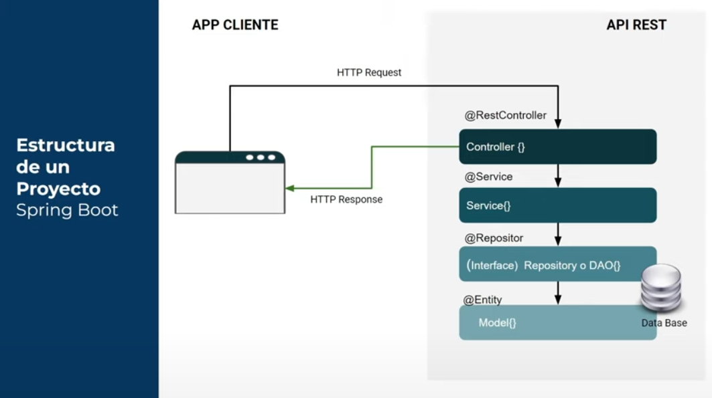

# Proyecto Fit-Femme

## Índice  
[Anteproyecto](Documentacion/Anteproyecto)  
[Diagramas](Documentacion/Diagramas/)  
[Código fuente](fitfemme)

## Introducción
Mi proyecto consiste en realizar un sistema completo para gestionar una tienda de suplementación deportiva utilizando una base de datos relacional<a href="#fn-1" class="footnote-ref">1</a>.  

El sistema incluirá una API REST para interactuar con los datos de la base de datos, realizando la documentación detallada de la API<a href="#fn-2" class="footnote-ref">2</a>, securizando los métodos para la manipulación de datos, y creando una interfaz web que permita la interacción con la API a través de JavaScript.

### API REST Spring Boot 3.3.0

Funcionamiento de request y responses:  

#### _Referencias_
<li id="fn-1">Base relacional utilizada: SQLite3<a href="#fnref-1" class="footnote-backref">↩</a></li>
<li id="fn-2">Documentación de la API realizada con Swagger.<a href="#fnref-2" class="footnote-backref">↩</a></li>

